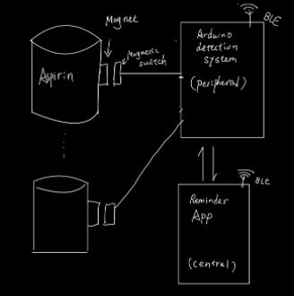
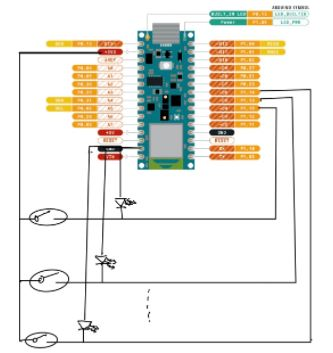
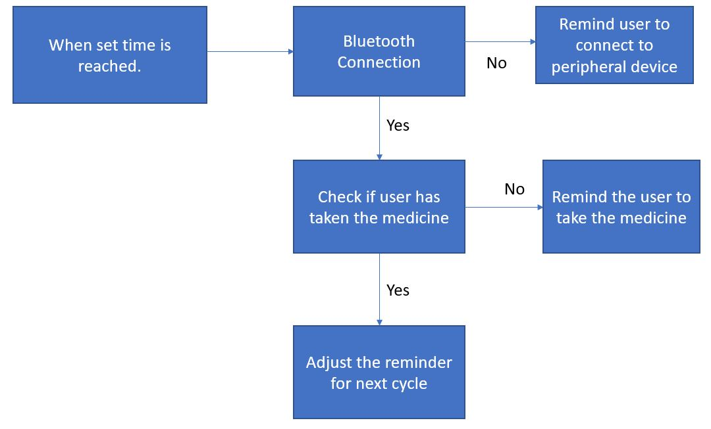
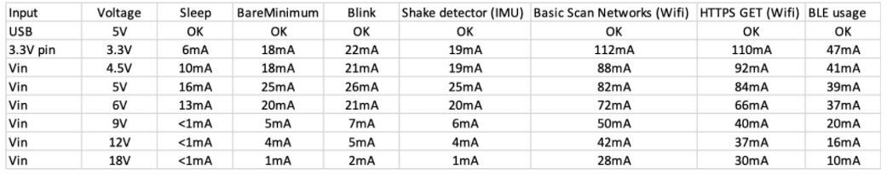

# BottleManager: Context-Based Medication Alert System
This is a course project of ECE M202A: Embedded System. The authors are Hongyi (Owen) Li and Weiting Ji.

[Project Presentation Video](https://youtu.be/6vCqH9a7_hs)

## Project Introduction
Nowadays, medicine and nutrition supplements are becoming an irreplaceable part of our lives. It is crucial for us to consume the designated dose at the designated time. For example, some medications are best if taken before the meal, while some are best if taken after, and some should be taken before going to bed. However, unknowns may happen, and people could miss the scheduled time to take the pills. Elder people might miss their medication due to amnesia. Adults may lose their track of medication by daily work. Many companies have developed apps or devices that could track users’ daily intake. But those types of devices usually cost a lot of money. Users also need to purchase multiple devices if taking various medications. So is it possible for us to design a more affordable and accessible solution? 

The objective of this project is to build a system using the small and cheap Arduino Nano 33 BLE Sense that can detect different contexts in which the user fails to take the medical pills and set up context-based alarms to inform the user. We want to minimally modify the pill bottle to maintain the maximum usability of the bottle. Additionally, we will develop an app that gives the alarm and allows the user to interact with the system. Moreover, the context the user fails to take the medication we are dealing with in this project is whether the user is busy doing other things or he just totally forgot to take; the context of when to take the medication is that the user should take the pills after the meal. In the future, more contexts will be analyzed and researched to reach the full context-based characteristics of the alarm system. Lastly, we want our monitor system and app to be interactable. This is achieved by the Bluetooth Low Energy (BLE) connection, which will be discussed later.

In conclusion, the three deliverable of our project should be
* Maximum compatibility
* Minimum cost
* Interactability

## Brief Timeline
* By 11/6 Literature search, purchase of material
* By 11/13 Design of alarm system, testing of Arduino
* By 11/25 Design of interative app
* By 12/12 Validation testing, report and video making

## Analysis of Literature
### Bluetooth LE Connection
Since our system consists of the Arduino part and the smartphone application part, the method of connection between them has become a crucial point of our project. In this project, we are using the Arduino Nano 33 BLE Sense in our embedded system, so it is certain that we are going to use Bluetooth Low Energy (BLE) connection to send and receive data. The most significant difference between conventional bluetooth and BLE is that BLE does not require one-to-one connection. In addition, BLE introduces much less power supply than bluetooth, which is good for long term monitoring using only a button cell battery. Take a look at the following figure that describes the role of devices in BLE connection.

<p align="center">
  
</p>

The BLE connection is like a bulletin board, where the peripheral device provides services and characteristics and the central devices act as clients of services (which is counter-intuitive in some sense). 

The Arduino BLE library is very powerful and integrated with the classes and methods for the service part. For use BLE in Arduino, we just need to include the library
```
#include<ArduinoBLE.h>
```
To start a BLE connection, we have the following code
```
if (!BLE.begin()){
    Serial.println("starting BLE failed!");
    while (1);
}
```
To detect whether the central device is connected, we have to first create a central device object and then do the detection
```
// create a central device object
BLEDevice central = BLE.central();

if (central) {
    while (central.connected()) {
	// put the main activity here
    }
}
```
To send or receive data, the relevant service and characteristic object should be created using ```BLE.addService```, ```service.addCharacteristic()```, and the system should start advertising these characteristics using ```BLE.advertise()```. After the central is connected, the system can use ```characteristic.writeValue()``` and boolean check ```characteristic.written()``` to send or receive data. 

Things are a little bit complicated at the central device side. We take the application based on iOS as an example. In the Xcode (IDE for iOS development) ```info.plist``` file, we have add new privacies ```NSBluetoothAlwaysUsageDescription, NSBluetoothPeripheralUsageDescription``` to get the permission of using BLE connection. To use the BLE functions in Xcode, we have to ```import CoreBluetooth```. The BLE functions are realized in iOS by ```CBCentralManager``` and ```CBPeripheral```, so we have enable the viewcontroller with these two classes by adding extensions
```
extension ViewControllwer: CBCentralManagerDelegate, CBPeripheralDelegate {
    // put main activity here
}
```
After initializing the manager and peripherals, there are mainly six steps to complete the BLE connection and manipulation.
1. Check the current status of manager
2. Check if the central manager has discovered a peripheral
3. Check if the peripheral has been connected to the central manager
4. Check if there exists a service in the peripheral matched by the given service UUID
5. Check if there exists a characteristic in the service matched by the given characteristic UUID
6. If step 5 is verified, do the read and write operation on the characteristic


### Prior Related Projects
We have searched for other kinds of smart bottle projects. Two of them is worth mentioning. The first one is [Arduino-Powered Water Bottle](https://create.arduino.cc/projecthub/taifur/arduino-powered-water-bottle-42ee43). It is a smart bottle that can keep track of your water intake and reminds you to drink enough water. The detection of water consumption is achieved using a waterproof ultrasonic sensor which can detect the water level inside the bottle. The program will then convert the water level into liters of water consumed and display it on the LCD segment display, then notify the user if there is not enough water consumption through a buzzer. We regard it as a passive device which has no interactions between the user and the system. In our design, we want the system to actively interact with the user for better experience. Besides, the design requires modification to the cap of the bottle to fit the arduino board, ultrasonic sensor and the LCD display which is the opposite to our goal that requires minimum modification to the original bottle. Also, the usability of the system is limited as the system is only suitable to track liquid instead of other kinds of substances. 

The second one is [Using an Arduino and a smartwatch to measure liquid consumed from any container](https://ieeexplore.ieee.org/document/7945434). It is a conference paper, so we are unable to find the source code for this project. Like the first one, this is also a water consumption tracker. The detection of water consumption is achieved using smartwatch gesture detection, and the system displays the water consumption on an app device. Compared to the first project, this one has significantly more compatibility since it detects the water consumption using an external device, but the cost of such an external device is usually high. One common problem of these two projects is that it uses regular Bluetooth, so the energy consumption is high, and it cannot last long without constant power supply (for the second project it seems not a big problem). Also, the regular Bluetooth limits the number of devices connected. Nevertheless, it is a nice and interesting project, and its system architecture is very similar to ours. 


## Design Process
### Technical Approach
As discussed, the BLE connection is like a bulletin board, where the peripheral device provides services and characteristics and the central devices act as clients of services. In our case, the Arduino board is the peripheral device, and the device installed with the app is the central device. We use Arduino Nano 33 BLE Sense board to monitor the status of our system. Each bottle will have a connection to the board through a magnet switch. With GPIO monitoring, arduino will acknowledge through its digital pin reading, and record the related time and update the associated BLE characteristics once one of the magnetic switches got disconnect from the board. Also, arduino monitors certain characteristics on the BLE side. For example, the buzzer switch. Once the buzzer switch characteristic got written by the app, the arduino will turn on or turn off the buzzer based on the given value. The central device side is basically a reminder app. It runs on ios, and uses UILocalNotfications to the user. But the thing different than a regular reminder app is that its triggering criteria is not the time but whether the device has received an advertisement from the peripheral device saying the user has not taken the pill yet. To achieve this function, we are going to use the Core Bluetooth library in Swift so that our device can act as a CBCentral and start to listen to the advertisement. 

### System Explained
Based on our technical approach we have the overall system architecture below. 

<p align="center">

</p>

The system is divided into three parts. The first part is the medicine bottle attached with a small magnet, which will cause the magnetic switch to turn on when they come into contact with each other. The detection system based on arduino will receive the status of the magnetic switch, pack it into a bluetooth characteristic, and advertise through BLE. The app will listen to the advertisement and set up notifications based on the received status of the magnetic switch as well as communicate with the detection system through BLE write functions. You may notice that it is possible to connect multiple bottles to the detection system. This is achieved by connecting magnetics switches to different output pins of the arduino board, as seen below. There are a total of 11 output pins, so theoretically the system can monitor 11 bottles together, although in reality, no one is going to take 11 different medicines at the same time. Also, an led light is connected to the ground in parallel with each magnetic switch. They serve as indicators of status as well as resistor to prevent short circuit.

<p align="center">

</p>

### Basic Functions
In our design, there are four basic functions that the bottle manager provides. 
* **Set up alarm**  Users can set up alarm for each individual medicine for desired time. With the set alarm, the system can remind the user based on contexts. In general, the system will first detect if there is a connection with the central device. 
* **Alarm the user based on contexts**  If there exists a connection, the system will decide whether to remind the user based on the data from the peripheral device. If the data shows that the user has taken the medicine, the system will automatically adjust the alarm to the next cycle. When the system does not detect a connection with the central device, it will remind the user that he or she needs to go to the bottle manager to take the medicine.
* **Adjust the alarm time**  As mentioned in previous point, the reminder system will automatically adjust the alarm based on the data from the central device based on the logic below. Therefore the reminders are more flexible and accurate rather than being fixed. 

<p align="center">

</p>

* **Location helper**  Sometimes, users might forget the location of their medicine so we developed a function help locate the device. By tapping a button on the app, it will trigger the buzzer and LED connected to the board to assist users find the device. 

## Demo
* [Demo1](https://youtu.be/-HIwt8tEfJs) 
* [Demo2](https://youtu.be/HzWRkifFVtQ)

## Discussion
### Energy Consumption
Since we are using BLE, we are very aware of the energy consumption, so we did a rough battery life test. Instead of powering the detection system directly from the computer USB port, we used 4 AA cells of 1.5 V with capacity of 2400 mAh (milliAmpere-hour) to power the system and left it on for days to see how long the system would last. The system eventually lasted approximately 10 days. The table below shows the Arduino Nano 33 current drain in different usage situations.

<p align="center">

</p>

According to the table, when the voltage supply is 6V, the current drain with BLE on is 37 mA, so the estimated battery life is 10.81 days, which is longer but very similar to our test result. This is reasonable since we only consider current drain from BLE usage. From the table, we can also see that if we were to use 6 AA cells, we would obtain the battery life of around 30 days since the current drain is only 20 mA. This is the longest battery life estimation, and therefore it is optimal to use 6 AA cells (or 9V equivalent cells) if we do not want to power it with a wall outlet or a USB port. 

### Strengths and Weaknesses
In conclusion, our system has demonstrated that BLE is a viable and reliable solution to this context-based alarm and notification system. As we have mentioned in the section of deliverables, the system’s advantages include its high compatibility with the bottle, which means it barely modifies the bottle so that we do not need to uninstall and reinstall the cumbersome equipment as discussed in the literature review. Also, it is interactable through bluetooth. The app can receive data from the Arduino board and perform the notification, and it can also send data to the board to enable location helper. And finally, it has very low energy consumption which is the major merit of using BLE. The major weakness is that we only assume that the patient has a fixed daily schedule. For example, if the patient has dinner at 6 pm punctually every day, whenever he takes the medicine that is supposed to be taken after a meal, the time should always be around 6.30 pm. It does not take into account that the time one has dinner may vary every day. Regarding whether the patient has really taken the medicine, detection by solely magnetic switch is also not completely reliable. Although in reality, for most of the time the reason people take a medicine bottle off the magnetic switch is that they are going to take the medicine, it still cannot guarantee 100 percent that the medicine has been taken. Lastly, the system does not support multiple users. 

### Future Improvements
We have proposed future improvements to solve the mentioned problems. Firstly, we can use a pressure sensor at the bottom of the bottle, so whenever the pills or liquid medicine has been taken, the mass of the bottle decreases, and the pressure will also decrease. We can use this to measure the remaining amount of medicine inside the bottle, and thus the detection will be much more accurate. We will also allow the app to access calendar so that we do not need to enter the time every time we are prescribed with a new medicine. More importantly, we are going to employ camera and microphone together with machine learning/natural language processing to make the context more flexible, which means we are no longer assuming fixed time. And last but not least, we want to store our data into more sophisticated data structures so the peripheral can be used for multiple central devices without cross-contaminating the data.


## Member Contribution
* Owen Li - Literature search, Hardware/Arduino development, Presentation recording 
* Weiting Ji - Literature search, Software/Application development, Report writing

## Material List
### Hardware
* Arduino Nano 33 BLE Sense
* 1.8-2.0 V Light Emitting Diode
* Breadboard and jumper wires

### Software
* Arduino IDE ver 1.8.13
* Xcode ver 12.2
* Testing device - iPhone iOS 14.2

## References
* [ArduinoBLE Library](https://www.arduino.cc/en/Reference/ArduinoBLE)
* [Arduino-Powered Water Bottle](https://create.arduino.cc/projecthub/taifur/arduino-powered-water-bottle-42ee43)
* S. Soubam, M. Agrawal and V. Naik, [Using an Arduino and a smartwatch to measure liquid consumed from any container](https://ieeexplore.ieee.org/document/7945434), 2017 9th International Conference on Communication Systems and Networks (COMSNETS), Bangalore, 2017, pp. 464-467, doi: 10.1109/COMSNETS.2017.7945434.
* [Getting Started with Bluetooth LE on the Arduino Nano 33 Sense](https://ladvien.com/arduino-nano-33-bluetooth-low-energy-setup/)
* [Simple Reminders Project](https://github.com/AfrazCodes/SimpleReminders)
* [Arduino Nano 33 IoT Guide](https://github.com/ostaquet/Arduino-Nano-33-IoT-Ultimate-Guide)
